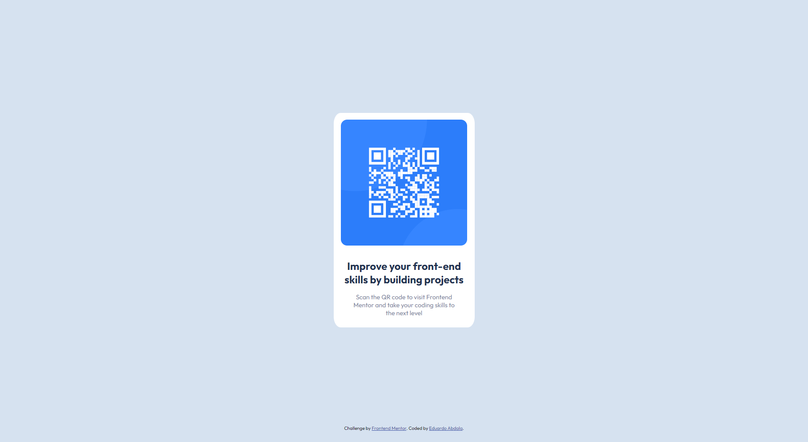
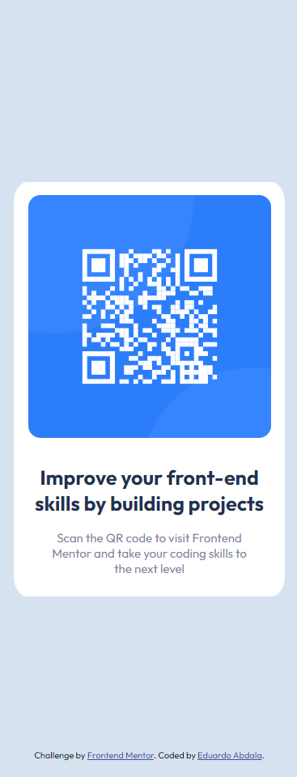

# Frontend Mentor - QR code component solution

This is a solution to the [QR code component challenge on Frontend Mentor](https://www.frontendmentor.io/challenges/qr-code-component-iux_sIO_H). Frontend Mentor challenges help you improve your coding skills by building realistic projects. 

## Table of contents

- [Overview](#overview)
  - [Screenshot](#screenshot)
  - [Links](#links)
- [My process](#my-process)
  - [Built with](#built-with)
  - [What I learned](#what-i-learned)
  - [Continued development](#continued-development)
  - [Useful resources](#useful-resources)
- [Author](#author)
- [Acknowledgments](#acknowledgments)

## Overview

### Screenshot

### Links

- Live Site URL: [https://qr-code-component-ruby-chi.vercel.app/](https://qr-code-component-ruby-chi.vercel.app/)

## My process

### Built with

- Semantic HTML5 markup
- CSS custom properties
- Flexbox
- Mobile-first workflow
- Pure CSS

### What I learned

I learned how to make a card using only CSS and HTML, I learned about HTML semantics, flaxbox and commits

### Continued development

Use this section to outline areas that you want to continue focusing on in future projects. These could be concepts you're still not completely comfortable with or techniques you found useful that you want to refine and perfect.

### Useful resources

- [Flexbox](https://www.alura.com.br/artigos/css-guia-do-flexbox) - This article helped me with flexbox.
- [Semantic HTML]([https://www.example.com](https://www.devmedia.com.br/html-semantico-conheca-os-elementos-semanticos-da-html5/38065#tag-figure)) - In this article I managed to get a better idea about HTML semantics.

## Author

- Website - [Eduardo Abdala](https://portifolio-azure-psi.vercel.app/index.html)
- Frontend Mentor - [@eduabdala](https://www.frontendmentor.io/profile/eduabdala)
- Twitter - [@otyel21](https://twitter.com/otyel21)

